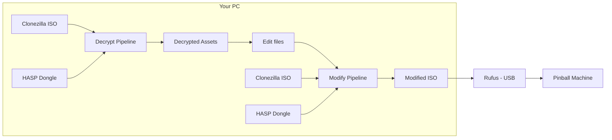
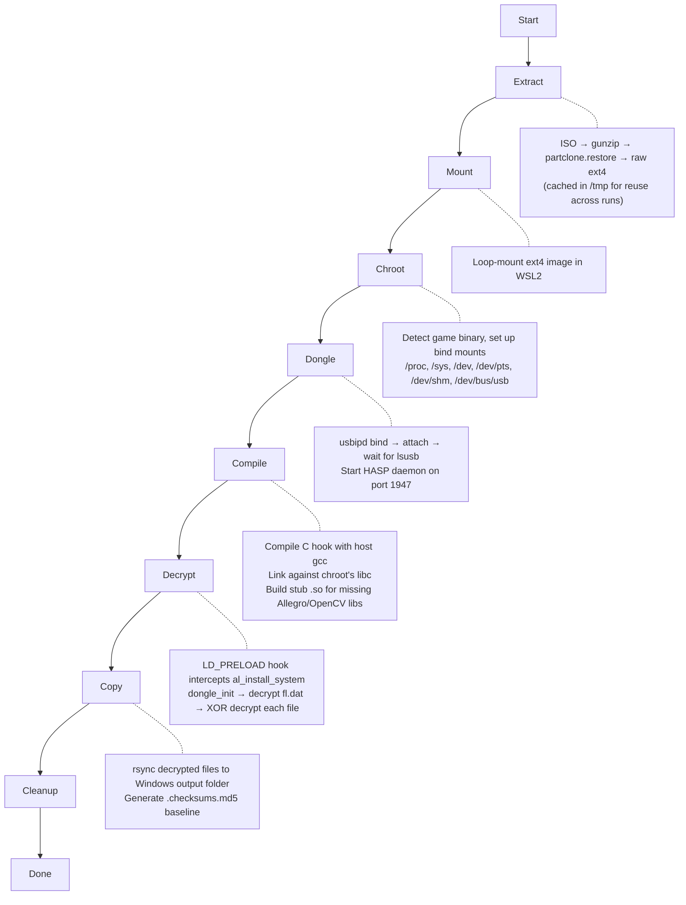
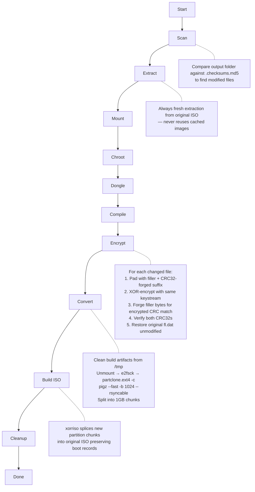

# JJP Asset Decryptor

A Windows GUI application for decrypting and modifying game assets on Jersey Jack Pinball (JJP) machines. Automates a complex multi-step process involving USB dongle authentication, filesystem extraction, cryptographic hooking, and ISO rebuilding — turning ~20 manual shell commands per game into a single button click.

## What It Does

JJP pinball machines store encrypted game assets (images, videos, audio, fonts) on their internal drives. Each machine ships with a Clonezilla backup ISO containing the full filesystem image. This tool:

1. **Decrypts** every asset in a game image by hooking the game binary's own crypto routines via `LD_PRELOAD`, using the physical Sentinel HASP dongle for authentication
2. **Re-encrypts** modified assets back into the game image with CRC32 forgery so the game's integrity checks pass without touching the file list
3. **Produces a bootable Clonezilla ISO** ready to flash onto the machine via USB

## Supported Games

Confirmed working:

- Willy Wonka & the Chocolate Factory
- Guns N' Roses
- Elton John
- The Hobbit

Not yet tested (but should work — same platform):

- Wizard of Oz
- Dialed In
- Toy Story
- The Godfather
- Avatar
- Harry Potter

Each game requires its own HASP USB dongle (the purple USB dongle attached to the motherboard inside the machine).

## Requirements

- **Windows 10/11** with WSL2 enabled
- **WSL2** with Ubuntu (or similar): `wsl --install`
- **gcc** in WSL: `wsl -u root -- apt install gcc`
- **usbipd-win**: Install from [github.com/dorssel/usbipd-win](https://github.com/dorssel/usbipd-win/releases)
- **Sentinel HASP USB dongle** for the game you want to decrypt
- **Game image**: Clonezilla ISO backup or raw ext4 filesystem image — download "full installs" from https://marketing.jerseyjackpinball.com/downloads/
- **Python 3.10+** (Windows): [python.org](https://www.python.org/downloads/)
- **Rufus** (for writing modified ISOs to USB): [rufus.ie](https://rufus.ie/)
- **~40 GB free disk space** in WSL — the extracted raw ext4 image can be up to 32 GB, plus temporary partclone chunks during ISO rebuilds

No additional Python packages are required (uses only the standard library).

The Modify Assets pipeline also requires `partclone` and `xorriso` in WSL — the tool installs these automatically on first use, or you can install them manually: `wsl -u root -- apt install partclone xorriso`

**Windows only.** The tool relies on WSL2 for Linux filesystem operations and usbipd-win for USB dongle passthrough.

## Installation

1. Clone the repository:
   ```
   git clone <repo-url>
   cd jjp
   ```

2. (Optional) Create a desktop shortcut with the app icon:
   ```
   create_shortcut.bat
   ```

3. Or launch directly:
   ```
   python -m jjp_decryptor
   ```
   You can also double-click `JJP Asset Decryptor.pyw` to launch without a console window.

## Usage

### Decrypting Assets

1. Launch the app
2. Prerequisites are checked automatically on startup
3. Click **Browse** to select your game image (ISO or ext4)
4. Click **Browse** to select an output folder for decrypted assets
5. Click **Start Decryption**

The app remembers your last-used paths between sessions.

### Modifying Assets

After decrypting, you can replace game assets and re-encrypt them:

1. Switch to the **Modify Assets** tab
2. Ensure the **Game Image** points to the **original Clonezilla ISO** and the output folder contains your decrypted files
3. Replace files in the output folder (PNGs, WebMs, OGGs, WAVs, etc.)
4. Click **Apply Modifications** — the tool detects changed files via checksums, re-encrypts only what changed, forges CRC32 checksums to match the original file list, and builds a new bootable Clonezilla ISO
5. The output `<name>_modified.iso` is saved to your output folder

### Installing on the Machine

1. Write the `_modified.iso` to a USB drive using [Rufus](https://rufus.ie/)
   - **Important: Use ISO mode (not DD mode) when Rufus prompts you.** DD mode will not produce a bootable drive for Clonezilla ISOs on JJP hardware.
2. Boot the pinball machine from the USB drive
3. Clonezilla restores the image automatically — the install script runs:
   `gunzip -t` → `partclone.restore` → `e2fsck` → `resize2fs` → `tune2fs`

### File Format Notes

- Images: **PNG** (same dimensions as originals)
- Videos: **WebM** (same codec/resolution as originals)
- Audio: **WAV** or **OGG** (matching the original format)
- Format or dimension mismatches won't corrupt the image but may crash or glitch the game at runtime

## Architecture

```
jjp_decryptor/
├── __main__.py      # Entry point (python -m jjp_decryptor)
├── app.py           # Application controller — wires GUI ↔ pipeline via thread-safe queue
├── gui.py           # Tkinter GUI with dark/light theme, tabs, progress tracking
├── pipeline.py      # DecryptionPipeline and ModPipeline — orchestrates all phases
├── resources.py     # Embedded C sources (decrypt hook, encrypt hook, stub libraries)
├── config.py        # Constants (paths, timeouts, known games, phase names)
└── wsl.py           # WSL2 command executor and Windows↔WSL path conversion
```

The app uses a **background thread + queue** pattern: the pipeline runs in a worker thread and posts `LogMsg`, `PhaseMsg`, `ProgressMsg`, and `DoneMsg` objects to a queue. The main thread polls the queue at 100ms intervals to update the GUI.

## How the Encryption Works

JJP games encrypt all assets (PNG, WebM, WAV, OGG, TTF, TXT) using a custom scheme tied to a Sentinel HASP hardware dongle:

1. **`fl.dat`** (the file list) is encrypted with `dongle_decrypt_buffer()`, which uses the dongle's hardware crypto. The decrypted content is CSV with one entry per line:
   ```
   /full/path/to/file.png,filler_size,crc32_encrypted,crc32_decrypted
   ```

2. **Each asset file** is encrypted by:
   - Seeding a custom PRNG with the file's full absolute path: `jcrypt_set_seeds_for_crypto(path)`
   - XOR-ing the entire file with a 64-bit keystream from `jcrypt_rand64()` in **little-endian** byte order
   - Prepending `filler_size` random bytes before the actual content

3. **Integrity checking** at boot: the game computes CRC32 of each encrypted file on disk (must match `n2`) and CRC32 of the decrypted content after filler removal (must match `n3`). Any mismatch triggers `FILE CHECK ERROR`.

### CRC32 Forgery

Rather than modifying `fl.dat` (which would require re-encrypting it with the dongle's session-specific keys), the tool uses **CRC32 forgery** to make modified files produce the exact same checksums as the originals:

- **N3 forgery**: 4 bytes are appended to the decrypted content so its CRC32 equals the original `n3`
- **N2 forgery**: 4 bytes within the random filler are adjusted so the encrypted file's CRC32 equals the original `n2`

This means `fl.dat` is restored byte-for-byte from its original encrypted form — no dongle re-encryption needed.

## Pipeline Details

### End-to-End Flow



### Decrypt Pipeline



| Phase | What Happens |
|-------|-------------|
| **Extract** | Decompresses Clonezilla ISO's partclone image to raw ext4 (cached for reuse) |
| **Mount** | Loop-mounts the ext4 image read-write in WSL2 |
| **Chroot** | Detects the game binary, sets up bind mounts for `/proc`, `/sys`, `/dev`, `/dev/pts`, `/dev/shm`, `/dev/bus/usb` |
| **Dongle** | Binds and attaches the HASP USB dongle to WSL via usbipd-win, starts the license daemon (`hasplmd`) |
| **Compile** | Compiles the C decryptor hook with WSL host gcc, links against the chroot's libc to avoid glibc version mismatch. Builds stub `.so` files for missing Allegro/OpenCV dependencies |
| **Decrypt** | Runs the game binary under `LD_PRELOAD` — the hook calls `dongle_init()`, decrypts `fl.dat`, then XOR-decrypts every asset using the game's own crypto functions |
| **Copy** | Copies decrypted files to the Windows output folder via rsync, generates MD5 checksums for change detection |
| **Cleanup** | Unmounts bind mounts and ext4, kills the HASP daemon, detaches USB from WSL |

### Modify Pipeline



| Phase | What Happens |
|-------|-------------|
| **Scan** | Compares output folder against `.checksums.md5` baseline to identify modified files |
| **Extract** | Extracts a **fresh** ext4 image from the original ISO (never reuses cached images to avoid accumulated state) |
| **Mount** | Loop-mounts the fresh ext4 image read-write |
| **Chroot** | Same as decrypt — detects game, sets up bind mounts |
| **Dongle** | Same as decrypt — attaches HASP dongle, starts daemon |
| **Compile** | Compiles the C encryptor hook (with CRC32 forgery logic) |
| **Encrypt** | Copies replacement files into chroot, runs game binary under `LD_PRELOAD` with the encryptor hook. For each file: forges CRC32 checksums, XOR-encrypts, verifies integrity. Restores original `fl.dat` unmodified |
| **Convert** | Cleans build artifacts from `/tmp` inside the image, unmounts, runs `e2fsck -fy`, converts to partclone format with `pigz --fast -b 1024 --rsyncable`, splits into ~1GB chunks matching the original layout |
| **Build ISO** | Uses `xorriso` to splice the new partition chunks into the original ISO, preserving all boot records (MBR, El Torito, EFI, Syslinux) |
| **Cleanup** | Unmounts everything, kills daemon, detaches USB, removes temp files |

## Troubleshooting

### "Sentinel key not found (H0007)"
The HASP dongle for the correct game is not plugged in or not detected. Each game requires its own dongle. Make sure:
- The dongle is plugged into a USB port (not a hub if possible)
- `usbipd list` shows the device (VID:PID `0529:0001`)
- You're using the dongle that came with the specific game you're decrypting

### "fl.dat decryption FAILED (not text)"
The dongle session wasn't established properly. Try running again — the app retries automatically up to 3 times with increasing delays.

### "Could not re-encrypt fl.dat"
The HASP session handle could not be extracted from the game binary. This means the modified files will work but the game may show FILE CHECK ERRORs at boot. Try running again with the dongle firmly seated.

### FILE CHECK ERROR on the machine
If the machine shows errors for ALL files after flashing:
- Ensure build artifacts were cleaned from the image before conversion (the tool does this automatically)
- Verify the ISO was written with Rufus in **ISO mode** (not DD mode)
- Check that the compression flags match the original (`pigz --fast -b 1024 --rsyncable`)

### Prerequisites check fails for gcc
Run in a terminal: `wsl -u root -- apt update && wsl -u root -- apt install gcc`

### Stale mounts from a previous crash
The app detects and cleans up stale mounts automatically on startup. If you have issues, you can manually clean up:
```
wsl -u root -- bash -c "findmnt -rn -o TARGET | grep /mnt/jjp_ | sort -r | xargs -r umount -lf; rmdir /mnt/jjp_* 2>/dev/null"
```

### Extraction is slow
The first run for each ISO requires extracting the partclone image to a raw ext4 file. This can take several minutes for large images (up to 32 GB). The raw image is cached so subsequent decrypt runs skip this step. Use the **Clear Cache** button (trash icon) to free up disk space.

## License

MIT License. See [LICENSE](LICENSE) for details.
